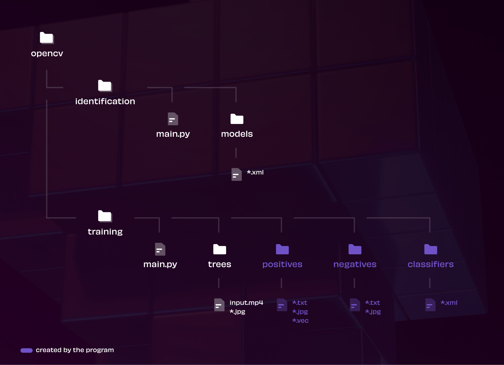
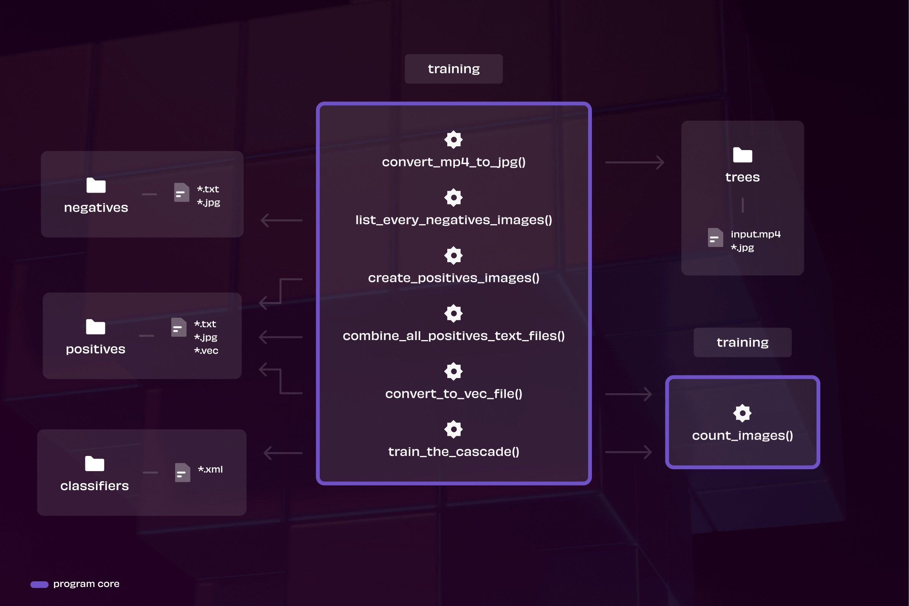
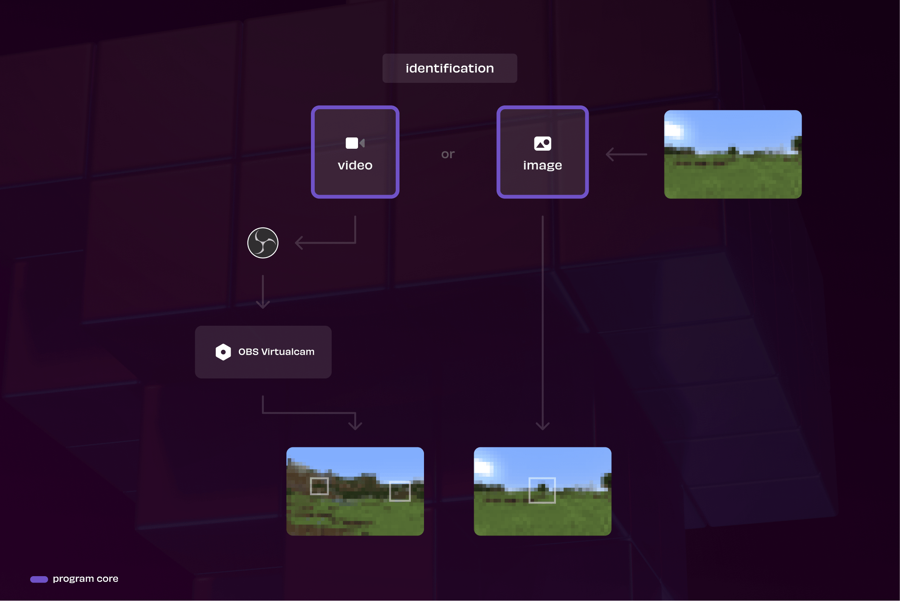

# OpenCV-Minecraft

OpenCV Minecraft is a project that aims to implement the [OpenCV](https://opencv.org/) library on the video game [Minecraft](https://minecraft.net).

This project comes from a class in my computer science school. I had the constraint to use the [OpenCV](https://opencv.org/) library to manipulate images. I decided to make a program that recognize an object (a tree) in the video game [Minecraft](https://minecraft.net).

[Documentation](https://docs.google.com/document/d/1ZlGSsDPuxT4mZsVWNyLaHXwyhqtaB1yeLEhQfmHXU44/) - [Specifications](https://docs.google.com/document/d/16gqORb4RyFK7fazQYQEVmj3Tza6Dj3DeS2O0oK9XvYk) - [Logbook](https://docs.google.com/document/d/1k9WzRwKpsKyxoCAJc5K88qaNXDz-lVgYPyrLLRAM08Y) - [Tests](https://docs.google.com/spreadsheets/d/1yqtHY-9enwXeF4ifdlbH_UFQ6cw2AWDfth4iRuGq-Hw/edit?usp=sharing)

 

## Project structure

### Folders structure

### Training structure

### Identification structure

### Demo

The demo is currently not available
